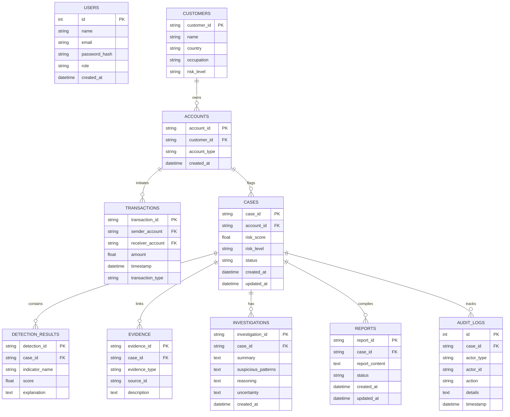

# Fintel Database Design & Schema

Fintel utilizes SQLAlchemy ORM with SQLite for development and PostgreSQL compatibility for production.

## Schema Entities

1. **`users`**: Platform compliance officers and system administrators.
2. **`customers`**: Synthetic KYC profiles with jurisdictions and occupation metadata.
3. **`accounts`**: Transaction accounts mapped to owning customers.
4. **`transactions`**: Directed financial movements with amounts, timestamps, and payment rails.
5. **`cases`**: Triggered investigations when account composite risk score exceeds the threshold (>= 60).
6. **`detection_results`**: Additive score contributions and explanations for flagged indicators.
7. **`evidence`**: Granular evidence entries mapping findings to specific transactions or graph metrics.
8. **`investigations`**: Structured AI findings, reasoning chains, and uncertainties.
9. **`reports`**: Structured SAR-style drafts with 9 sections.
10. **`audit_logs`**: Immutable chronological record of system and user events.
